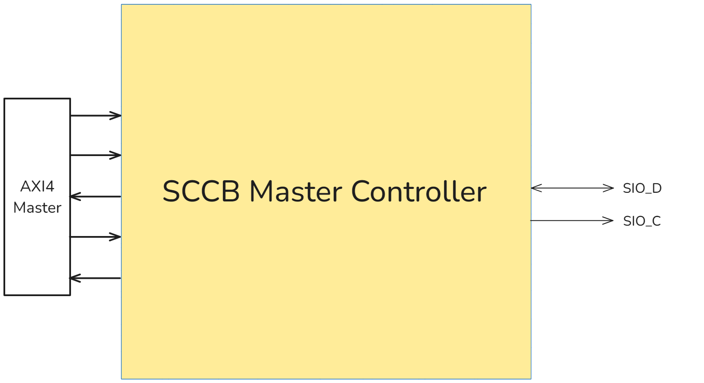

# SCCB Master Controller

*Specification of SCCB Master Controller* 

# 1. Introduction

SCCB Master Controller is a module, used to communicate with a SCCB Slave interface via SCCB (*Serial Cameral Control Bus*) protocol. The module provides the AXI4 interface to communicate with the system. The controller supports some features:

- Configuration:
    - ***Soft-configuration***: the system configures the controller via AXI4 Interface (*the memory-mapping mechanism*). Some soft configurations are the slave device’s address, the prescaler of the SCCB clock
    - ***Hard-configuration***: The user configures the controller via parameters in the RTL level. Some hard configurations are the memory base of each feature of the module, the depth of buffers used in the module
- Streaming
    - ***TX streaming***: the system sends information of transmission to and signals the module via the AXI4 interface to issue the Write/Read transmission via the SCCB interface
    - ***RX streaming***: the system receives read data from the SCCB slave via the AXI4 interface

## 1.1. Interface

The module has 2 main interfaces:

- AXI4 Slave interface (connect to the system)
- SCCB Master interface (connect to the SCCB slave)

## 1.2. Block diagram

# 2. Memory mapping

The module has 3 main memory regions: configuration region, TX streaming region and RX streaming region. The user can modify the base address of each region via parameters in the RTL file:

- `IP_CONF_BASE_ADDR` parameter: represents the base address of the Configuration region
- `IP_TX_BASE_ADDR` parameter:  represents the base address of the TX Streaming region
- `IP_RX_BASE_ADDR`  parameter: represents the base address of the RX Streaming region

## 2.1. Configuration

The configuration region contains all registers used to set the mode of the controller or the parameter of the SCCB transmission

| Register’s name | Description | Width | Address (default) |
| --- | --- | --- | --- |
| `SLV_DVC_ADDR_REG`  | Slave device’s address registers | 8 | `*0x2000_0000*` |
| `PRESCALER_REG` | The prescaler (clock divider) of the SCCB clock | 8 | `*0x2000_0001*` |

## 2.2. TX Streaming

The TX streaming region contains buffers used to issue a Read/Write SCCB transmission. Each type of transmission needs some information to issue a transmission. Therefore, the system must write the data to the corresponding buffer via the AXI4 interface to create a SCCB transmission.

| Buffer’s name | Description | Width  | Address (default) |
| --- | --- | --- | --- |
| `CONTROL_BUF`  | Control signal buffer | 8 | `*0x2100_0000*` |
| `SUB_ADDR_BUF`  | The sub-address buffer of a SCCB transmission | 8 | `*0x2100_0001*` |
| `WRITE_DATA_BUF`  | The write data buffer of a SCCB transmission | 8 | `*0x2100_0002`*  |
- `CONTROL_BUF` bitmap
    - Bit 7 - 3: Reserved
    - Bit 2: Represents the type of transmission (1: Write - 0: Read)
    - Bit 1 - 0:
    - Represents the number of phases in a transmission

## 2.3. RX Streaming

The RX streaming region contains a buffer used to store the read data of previous SCCB transmissions. The system issue the Read transaction to this region via AXI4 interface to receive the read data.

| Buffer’s name | Description | Width  | Address (default) |
| --- | --- | --- | --- |
| `READ_DATA_BUF`  | Read data of SCCB transmissions buffer | 8 | `*0x2200_0000*` |

# 3. Description

## 3.1. Features

### 3.1.0. AXI4 Slave Interface

The system communicates with the module via the AXI4 protocol. The controller’s AXI4 interface supports some features:

- Multi-burst transaction
- Error response
- Configurable bus

**AXI4 ports list**:

- AW channel
    
    
    | Port | Direction | Width (configurable) | Description |
    | --- | --- | --- | --- |
    | `m_awid_i`  | Input | `MST_ID_W` | The ID of the transaction  |
    | `m_awaddr_i` | Input | `ADDR_W` | The write address |
    | `m_awlen_i` | Input | `TRANS_DATA_LEN_W` | The length of the transaction |
    | `m_awvalid_i`  | Input | 1 | The valid signal |
    | `m_awready_o` | Output | 1 | The ready signal |
- W channel
    
    
    | Port | Direction | Width (configurable) | Description |
    | --- | --- | --- | --- |
    | `m_wdata_i`  | Input | `DATA_W` | The write data |
    | `m_wlast_i` | Input | 1 | The write last signal |
    | `m_wvalid_i`  | Input | 1 | The valid signal |
    | `m_wready_o` | Output | 1 | The ready signal |
- B channel
    
    
    | Port | Direction | Width (configurable) | Description |
    | --- | --- | --- | --- |
    | `m_bid_o`  | Output | `DATA_W` | The ID of the transaction |
    | `m_bresp_o` | Output | 1 | The response of the transaction |
    | `m_bvalid_o`  | Output | 1 | The valid signal |
    | `m_bready_i` | Input | 1 | The ready signal |
- AR channel
    
    
    | Port | Direction | Width (configurable) | Description |
    | --- | --- | --- | --- |
    | `m_arid_i`  | Input | `MST_ID_W` | The ID of the transaction  |
    | `m_araddr_i` | Input | `ADDR_W` | The read address |
    | `m_arlen_i` | Input | `TRANS_DATA_LEN_W` | The length of the transaction |
    | `m_arvalid_i`  | Input | 1 | The valid signal |
    | `m_arready_o` | Output | 1 | The ready signal |
- R channel
    
    
    | Port | Direction | Width (configurable) | Description |
    | --- | --- | --- | --- |
    | `m_rid_o` | Output | `MST_ID_W` | The ID of the transaction |
    | `m_rdata_o`  | Output | `DATA_W` | The read data |
    | `m_rlast_o` | Output | 1 | The read last signal |
    | `m_rvalid_o`  | Output | 1 | The valid signal |
    | `m_rready_i` | Input | 1 | The ready signal |

### 3.1.1. Configuration

There are 2 configuration registers in the configuration region. The system can issue write transactions to set the value of the 2 registers via the AXI4 Interface.

- `SLV_DVC_ADDR_REG` register: To set the value of the Slave device address in a SCCB transmission (the **upper 7 bits** of 1st phase - see below figure)
    
    
    

- `PRESCALER_REG` register: To select the clock divider for the SCCB clock (*update later*)

### 3.1.2. TX Streaming

The system can write or read the TX Streaming region via AXI4 Interface. There are 3 types of buffers in the TX Streaming region. Each type of buffer contains the information for one corresponding SCCB transmission:

- `CONTROL_BUF` buffer: contains the control signal, type of transmission, number of phase of transmission
- `SUB_ADDR_BUF` buffer: contains the value of the sub-address in a Read/Write SCCB transmission
- `WRITE_DATA_BUF` buffer: contains the write data in a Write SCCB transmission

**Operators**:

- *Write operator*: the system writes the data to the mapped buffer via AW channel and W channel of the AXI4 interface, and receives the response via B channel of the AXI4 interface. Each buffer has limited capacity, so when a mapped buffer is full, the controller will not accept write data from the system—the slave’s W channel will not handshake with the master.
- *Read operator*: the system issues the read transaction via AR channel of the AXI4 interface. After that, the controller will return **the status (remaining slots) of the mapped buffer** via R channel of the AXI4 interface.

**To issue a SCCB transmission**: 

- To issue an SCCB transmission, the system writes data into `CONTROL_BUF` to start the controller and inform it of the type of transmission. After that, the system needs to provide the corresponding values based on the requested transmission type to issue the SCCB transmission. Each transmission requires the following corresponding information:
    
    
    |  | `CONTROL_BUF` | `SUB_ADDR_BUF` | `WRITE_DATA_BUF`  |
    | --- | --- | --- | --- |
    | 2-phase write transmission | W/R bit = 1; Phase amount = 2 | ✅ | ❌ |
    | 3-phase write transmission | W/R bit = 1; Phase amount = 3 | ✅ | ✅ |
    | 2-phase read transmission | W/R bit = 0; Phase amount = 2 | ❌ | ❌ |
- For all three buffers, the order of the data written is arranged based on the FIFO (First-In-First-Out) mechanism. Therefore, the order of transfers sent to `SUB_ADDR_BUF` buffer and `WRITE_DATA_BUF` buffer to issue SCCB transmissions should match the order of transfers sent to `CONTROL_BUF` buffer

⇒ A SCCB transmission is only initiated when all the corresponding values for that transmission have been completely written into the respective buffers.

> **Caution**: The sub-address or write data information used for previous SCCB transmissions will be lost once it has been used by the transmission. Therefore, the system should write new information to the corresponding buffer.
> 

### 3.1.3. RX Streaming

The RX Streaming region contains 1 buffer `READ_DATA_BUF`, used to store the read data from SCCB transmissions. The system can read the data via the read channel of the AXI4 interface.

**Operator:**

- *Write operator*: DO NOT accept, the controller will return the ERROR response.
- *Read operator*: The system issues a read transaction via the AR channel of the AXI4 interface. The controller then returns the read data from the SCCB transmission via the R channel of the AXI4 interface. If the data is not available, the controller’s R channel will not handshake with the master.

**To receive the read data from a SCCB slave**

- To read data from a SCCB slave, the system must issue a read SCCB transmission via the TX Streaming region (see section 3.1.2)
- The data, received from the previous SCCB transmission, will be store into the `READ_DATA_BUF` buffer of the RX Streaming region
- The system can read the data via the AXI4 interface

> **Caution**: When the system issues too many read transactions **without reading from the RX Streaming region**, some data may be skipped due to the capacity limitation of the `READ_DATA_BUF` buffer.
> 

## 3.2. Timing diagram

- AXI4 Interface
    - Writing the data to the Controller via AXI4 interface
    
    
    

- SCCB Interface
    - 2-phase write transmission
        - Device address: 0x42
        - Sub-address: 0x2A
    
    
    
    - 3-phase write transmission
        - Device address: 0x42
        - Sub-address: 0x5A
        - Write data: 0xFF
    
    
    
    - 2-phase read transmission
        - Device address: 0x42
        - Read data: 0x5A
        - The `sio_oe_m` signal represents the tri-state control of the `SIO_D` bus. If `sio_oe_m` is LOW, the master controls the bus, and if `sio_oe_m` is HIGH, the slave controls the bus.
    
    